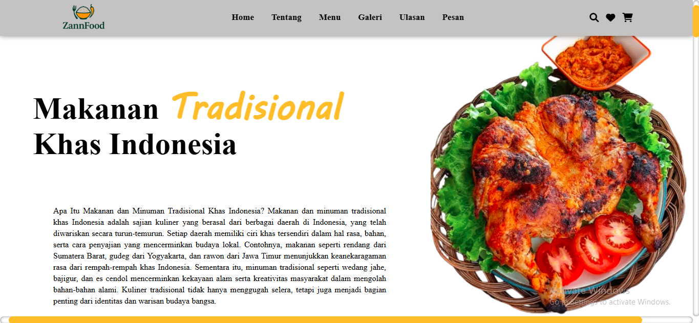
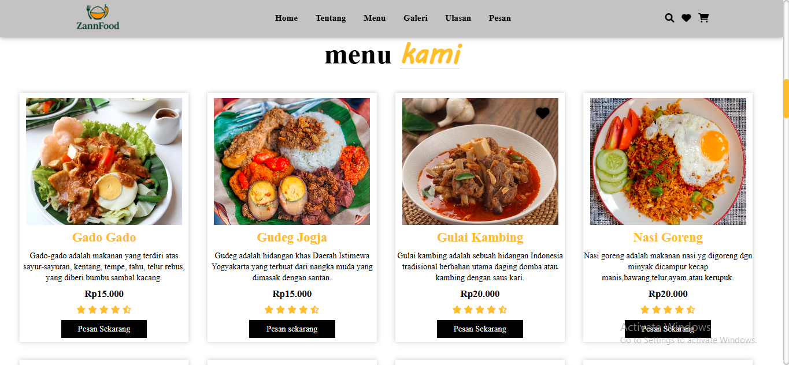
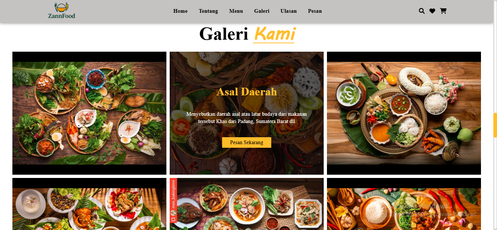

<div align="center">
<h1 align="center">Hi, I'm Zann_Opz 👋</h1>

  <div align="center">
    
    
    
    
    
    
    
    
    
    
    
    
    
    
    
    
    
    
    
    
    
    
    
</div>
</center>
<p align="center">A Frontend Developer who loves turning coffee into beautiful user interfaces.</p>

<div align="center">
<a href="https://github.com/piyushsuthar/github-readme-quotes">
  
</a>
</div>

<p align="center">
  
</p>

  [](https://www.tiktok.com/@zannopz?is_from_webapp=1&sender_device=pc)
  
  
[](https://www.instagram.com/zann_opz/)


  <h2 align="center">Website - Zannfood</h2>

  Website ke-1 gua yang dimana mungkin masih banyak kurangnya yaitu dari Segi ke-Resposifan belum ada sama sekali, 
  jadi Website tersebut belum sempurna untuk Mobile.
  Lalu website saya ini dikombinasikan masih dengan Bahasa Pemograman basic yaitu HTML dan CSS saja.

  <a href="https://zannopz.github.io/Website-ZannFood/"><strong>➥ Live Demo</strong></a>
<div align="center">

<br><br>
</div>
</div>


### Demo Screeshots
<div align="center">

</div>





<div align="center">

</div>

### Prerequisites

Before you begin, ensure you have met the following requirements:

* [Git](https://git-scm.com/downloads "Download Git") must be installed on your operating system.

### Run Locally

To run **Tourest** locally, run this command on your git bash:

Linux and macOS:

```bash
sudo git clone https://zannopz.github.io/Website-ZannFood/
```

Windows:

```bash
git clone https://zannopz.github.io/Website-ZannFood/
```

### Kontak

Jika Lu pengen bertanya-tanya langsung ajja ke Instagram gua [](https://www.instagram.com/zann_opz/)


### Lisensi

Proyek ini gratis untuk digunakan dan tidak mengandung lisensi apa pun.
Anda bebas untuk menyalin, mengubah, mendistribusikan, atau menggunakan ulang kode ini untuk keperluan pribadi maupun komersial tanpa batasan. Namun, proyek ini disediakan sebagaimana adanya, tanpa jaminan atau tanggung jawab dari pengembang.

<div align="center">

<br><br>
</div>

